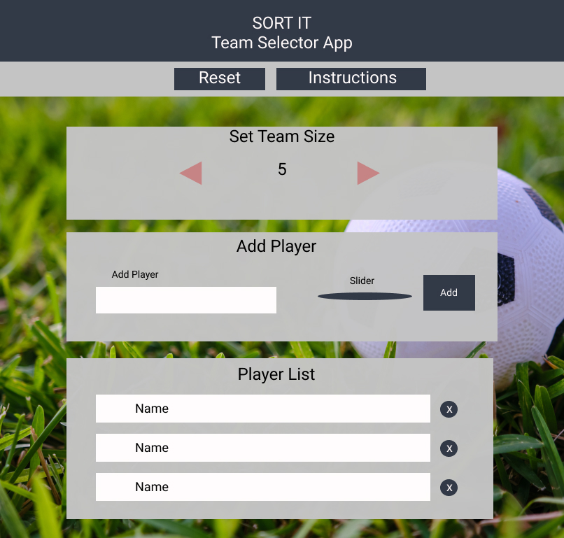

<!-- The core of the challenge is to create a tool which randomly picks 5-a-side football teams from a list of 10 names. -->

## Wireframe

## **Initial thoughts**: 
-	Use React Redux – start with frontend. If time, deploy a backend to store matches/teams. 
-	Build minimum viable product (MVP) - enter 10 player names, split into teams of 5 randomly.
-	Use git and branches to commit/track development of app
-	Use redux to store and track state – easily accessible
-	Use local storage 
-   Style/layout once MVP components built

### **My design + stretch goals**
**Front-end:**
- Meet MVP requirement 
- Increase n of players per side, e.g. 5, 7, 10 etc.
- Add skill level aspect - added to player object
- Sort teams randomly, but by skill = semi balanced teams
- Pick team jersey + colour 
- Home/away
- Bookies favourite - team that has highest skill rating, taking into account home advantage. Home advantage will be between 10 and 25% of skill value 

**Back-end:**
- Track teams inc each indv player, date, bookies favourite
- Stretch - add a winner looser, will have to implement this to front-end 1st

## **MVP**:
-	Component, form to input player names 
    - Validation to ensure 10 players are added
-	Component, List to display players added
-	Logic, generate random teams of 5
-	Component, List to display teams of 5 

### **Build Steps**
- Setup GitHub repo
- Setup react redux and local storage
- Create initial state, reducer, store
- Build components:
   1. Header 
   2. Input form
   3. Input button
   4. Slider
   5. List of added players
   6. Select Number of player
   7. Kit colour picker
   8. Reset
   9. Team Names
   10. List of teams
- Control UI experience - logic moving through components
- Test
- Add styling
- Finalize 
- Code refactor/clean